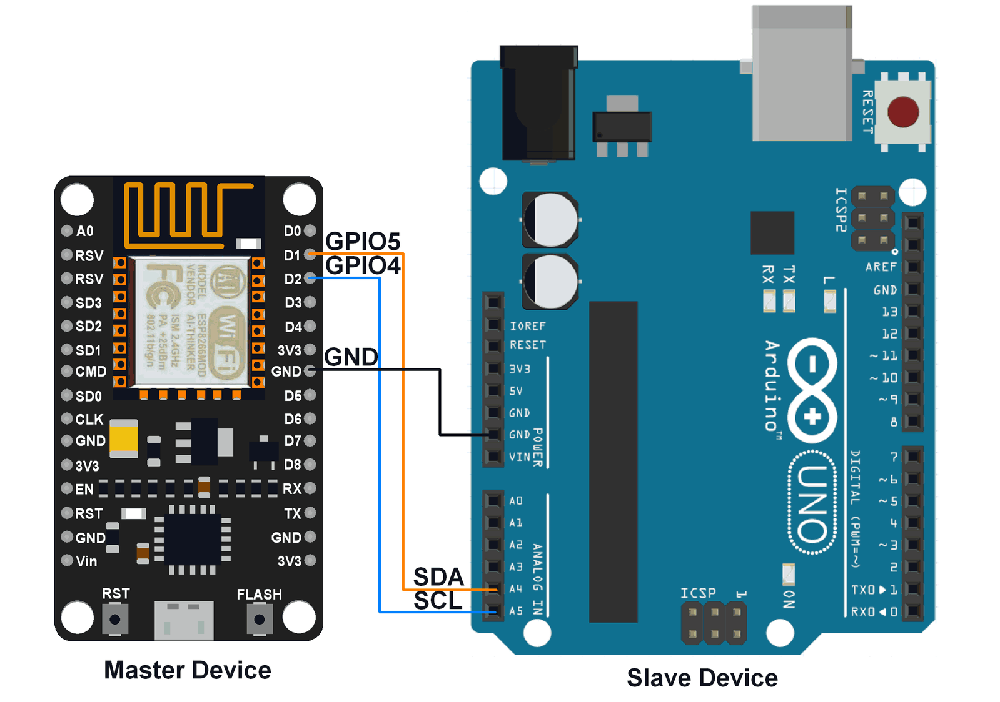

Introduction
------------

A simple set of files to allow web communication with an Arduino and a NodeMCU (esp8266).
This simple example was extracted from 3 different sources

* [Add Wifi & GPIOs to Arduino Uno with NodeMcu](https://github.com/nassir-malik/Add-Wifi-And-GPIO-To-Arduino-Uno-With-NodeMcu)
* [NodeMCU I2C with Arduino IDE](https://www.electronicwings.com/nodemcu/nodemcu-i2c-with-arduino-ide)
* [UDP NodeMCU](https://arduino-esp8266.readthedocs.io/en/latest/esp8266wifi/udp-examples.html#complete-sketch)

Board Layout
------------
Connecting the two boards together is simple and can be seen in this image.

The image comes from the [NodeMCU I2C with Arduino IDE site](https://www.electronicwings.com/nodemcu/nodemcu-i2c-with-arduino-ide).

Code Compiling
--------------
The Arduino IDE was used to compile the code for the NodeMCU and the Arduino.
In order to compile code for the NodeMCU the board has to be added.
Instructions can be found [here](https://arduino-esp8266.readthedocs.io/en/latest/installing.html).

Checking Functionality
----------------------
Per the suggestion in the [UPD NodeMCU site](https://arduino-esp8266.readthedocs.io/en/latest/esp8266wifi/udp-examples.html#how-to-check-it)
I used [Packet Sender](https://packetsender.com/download) to verify that everything was working properly.
